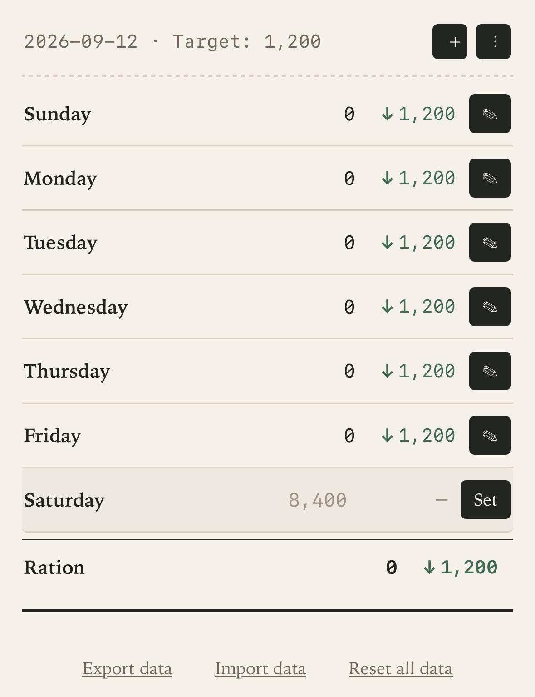
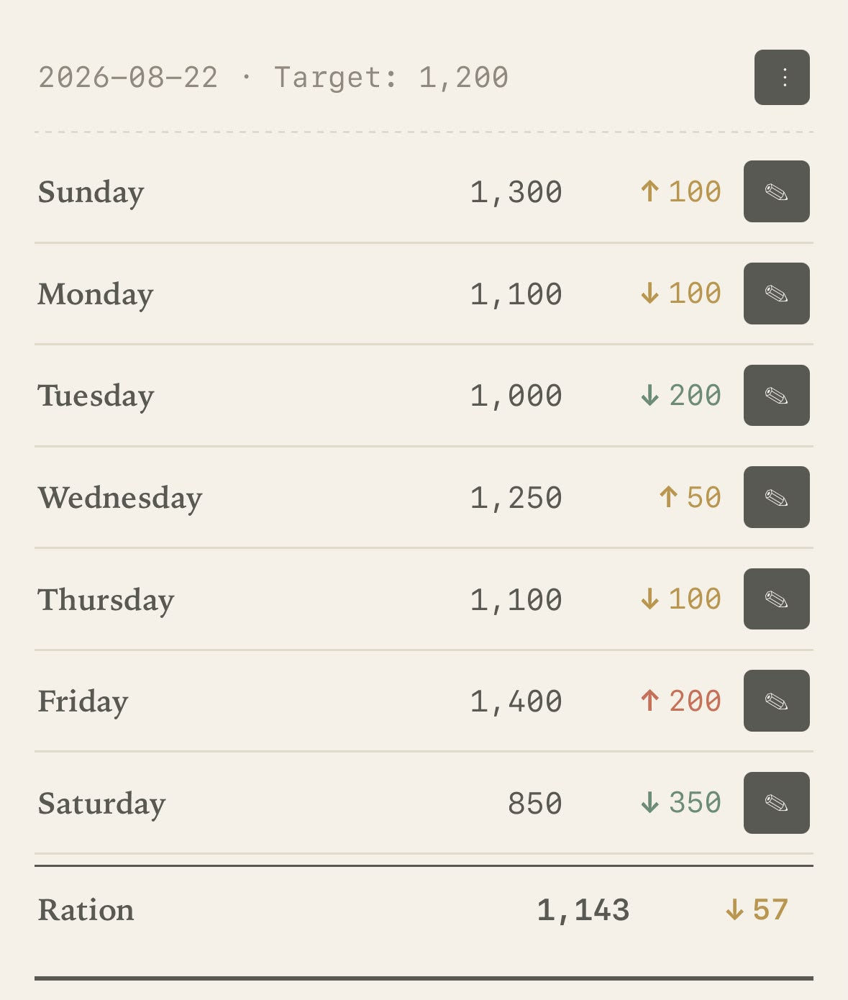
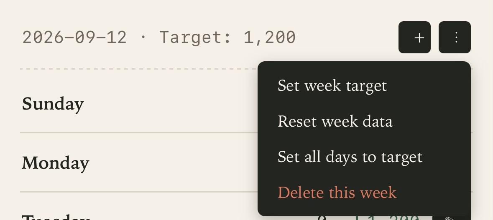

# Calorie Ledger

A simple, fast, and offline-first web app to track your weekly calorie budget. Built for real life — focus on weekly balance, not daily perfection.

**Live App:** [Calories Tracker](https://nouraWael0.github.io/Calories-Tracker/)

---

## Overview & Screenshots

| Empty Week | Logged Week | Week Settings |
| :---: | :---: | :---: |
|  |  |  |

---

## Core Features & Usage Guide

### 1. Daily Target & Automatic Average
* **Setting Your Target:** You set a baseline daily calorie goal once.
* **Automatic Average:** The app calculates your actual daily average in real-time as you log meals, showing whether your week is on track overall rather than judging a single day.

### 2. Smart Budget Redistribution (The Dynamic Allowance)
* **Adaptive Remaining Calories:** When you overeat or undereat on any given day, the app automatically redistributes the remaining weekly budget across the rest of the week.
* **Real-time Adjustment:** If you eat more today, your suggested allowance for upcoming days slightly decreases to keep your overall weekly average balanced.

### 3. Visual Indicators & Trend Arrows
* **Color-Coded Status:** 
  * **Green:** Indicates you are within your target budget.
  * **Red / Warning:** Shows when a day or the weekly average exceeds your planned budget.
* **Trend Arrows:** Dynamic arrows next to your numbers instantly indicate whether your calorie intake is trending higher or lower compared to your average.

### 4. Data Privacy, Export & Import
* **Local Storage:** All your logs and settings stay 100% on your local device.
* **Export Data:** Easily download a complete JSON backup of your weekly logs at any time.
* **Import Data:** Restore or transfer your tracked data to another browser or device with a single click.

---

## How to Install

1. Open the **[Live App Link](https://nouraWael0.github.io/Calories-Tracker/)** in your browser.
2. Tap **Share / Options** in your browser and select **Add to Home Screen**.
3. Launch the app anytime right from your phone's home screen!